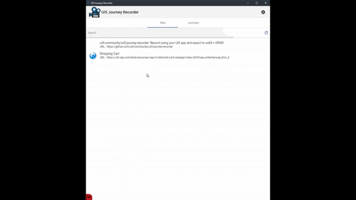
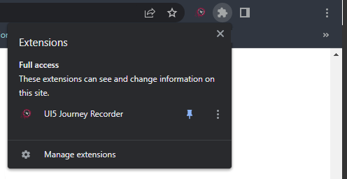
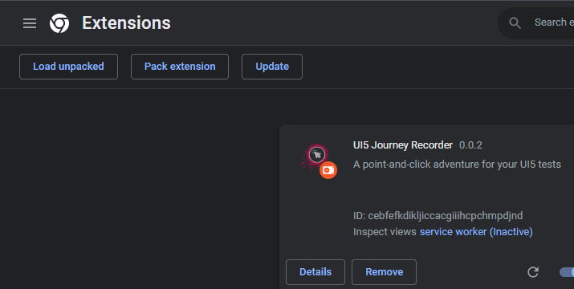

# UI5 Journey Recorder

The _UI5 Journey Recorder_ is a [Chrome](https://www.google.com/chrome/)-Extension.
It is used to record and generate test journeys for [UI5](https://ui5.sap.com).

The recorded journeys can be used to generate [OPA5](https://ui5.sap.com/#/topic/7cdee404cac441888539ed7bfe076e57) or [wdi5](https://github.com/ui5-community/wdi5) test code.

    

# Installation

The _UI5 Journey Recorder_ can be installed via the [Chrome WebStore](https://chrome.google.com/webstore/detail/ui5-journey-recorder/clhcepeibbgcdmhalaaomdpofecmgimf).
After that the _UI5 Journey Recorder_ can be accessed via the Extension Menu at the top right of **Chrome**.
Another way to install the _UI5 Journey Recorder_ is via the setup of the [development environment](./docs/Contribution.md). 
In the end you can open the extension via the extension menu at the top right of Chrome: 

Another way to install the _UI5 Journey Recorder_ is to download the zip of a release from the release section of github and unpack it where you want. 
Then go to the extension site of chrome ([chrome://extensions](chrome://extensions)) and load the unpacked extension by using the button at the left top corner .

## License

This work is dual-licensed under Apache 2.0 and the Derived Beer-ware 🍺 License. The official license will be Apache 2.0 but finally you can choose between one of them if you use this work.

Thus, when you like this stuff, buy [any (or all 😆) of the contributors](https://github.com/ui5-community/ui5-journey-recorder/graphs/contributors) a beer when you see them.
