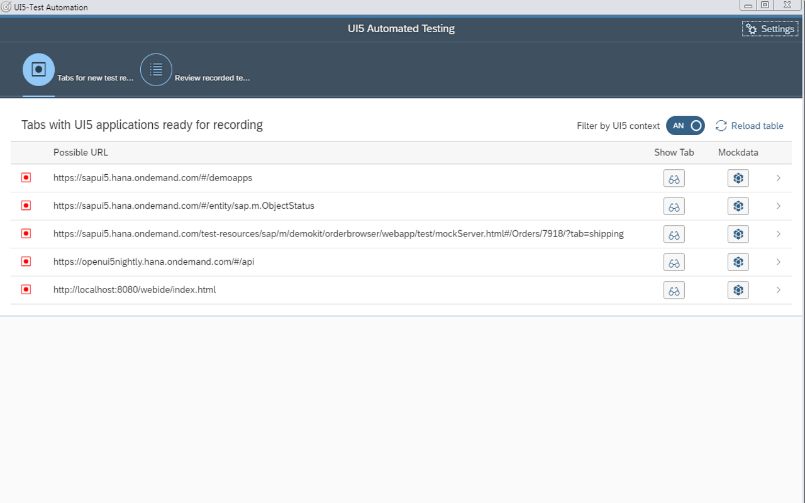
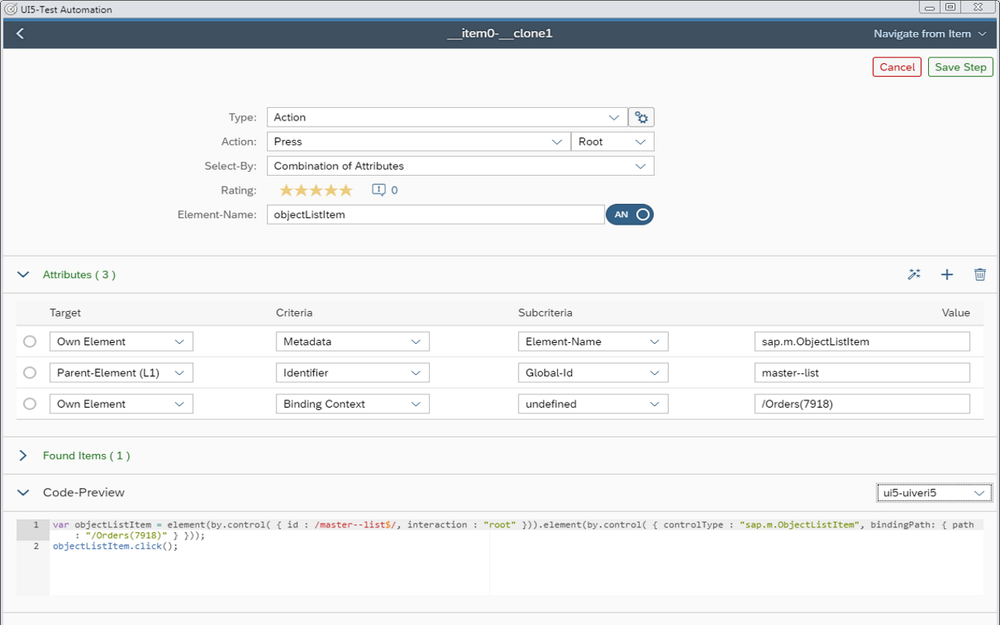

# UI5 Test Recorder

The tool enables efficient test-automation for SAP UI5 and OpenUI5 Applications, by providing you a test-recorder for UI5 with exporting capabilities to uiveri5, testcafe and OPA5.
During recording the tool supports you in setting the perfect combination of unique attributes in order to allow a stable test-execution.

The chrome plugin is published in Google-Webstore under https://chrome.google.com/webstore/detail/hcpkckcanianjcbiigbklddcpfiljmhj 

The tool has support for the following test-frameworks:
- uiveri5
- testcafe
- OPA5 (in Development)

The following Screenshots are showing the capabilities of the recorder.

Start-Page: Create a new recording, or open an existing one

Example Selection Page
