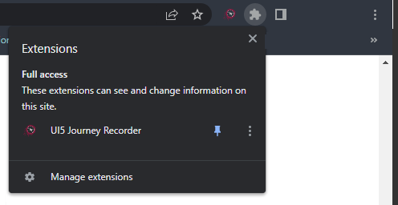

# Contribution

Because the _UI5 Journey Recorder_ is a Chrome Extension the Chrome-Webbrowser is required.

## Prerequisites

- UI5 app running in the browser, accessible via `http(s)://host.ext:port`.
  Recommended tooling for this is either the official [UI5 tooling](https://github.com/SAP/ui5-tooling) (`ui5 serve`) or some standalone http server like [`soerver`](https://github.com/vobu/soerver) or [`http-server`](https://www.npmjs.com/package/http-server).
- UI5 app using UI5 >= `1.60` (because the [`RecordReplay` API](https://ui5.sap.com/sdk/#/api/sap.ui.test.RecordReplay) is used extensively which is only available from UI5 `1.60`+)
- Node.js version >= `14` (`lts/fermium`)
- Angular CLI 14 (because the extension is based on Angular 14) (`npm install -g @angular/cli`)

##  set up the dev environment
1. Clone the repo from [Github](https://github.com/ui5-community/ui5-journey-recorder.git)
2. Navigate to the app folder of the repository and install the dependencies `npm install`
3. Execute the build:dev `npm run build:dev` to build
   3.1. OR Execute the build:watch `npm run build:watch`
5. Open Chrome and the [Chrome-Extension Page chrome://extensions](chrome://extensions)
6. Choose the "Load unpacked" Button in the top left
  
7. Choose the dist-folder `<repository-path>\dist`
8. Now open the *UI5 Journey Recorder* from the extension menu at the top right of Chrome
   (Use the pin to make the extension always accessible)
  

## extension documentation

The documentation for the code is done via [Compodoc](https://www.npmjs.com/package/@compodoc/compodoc).
Therefore you just have to execute the *doc, doc:serve or docu:coverage* NPM-Script by `npm run doc`.
After this you can open the documentation from `app\documentation\index.html`.

## work on the *UI5 Journey Recorder*
The *UI5 Journey Recorder* consists of two parts: 
- the injected content
- the popup content

### Injected content
This is the part which is injected into the page where the journey should be recorded. Here you can find the: 
- page_inject
- communication_inject
- content_inject

#### page_inject
The page_inject contains all necessary functionality to detect ui5 controls, replay actions gather control informations

#### communication_inject
The communication_inject contains a REST-Like interface to communicate with the popup-Part of the Extension. 
This should enable an easier extension and maintenance of the extension-page-communication.

#### content_inject
The content_inject is the bridge between the page and the extension-popup it contains the load-up for the page_inject and communication_inject. 
Additonally it creates a "bridge"/"passthrough" for the communication-events.

## debugging
All parts of the extension can be debugged with the default Chrome-Debbuging tools. 

## commiting changes
Changes are only allowed via Pull-Requests.
We have a setup of eslint for eslint please be aware of these.

"More to be comming"
