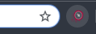
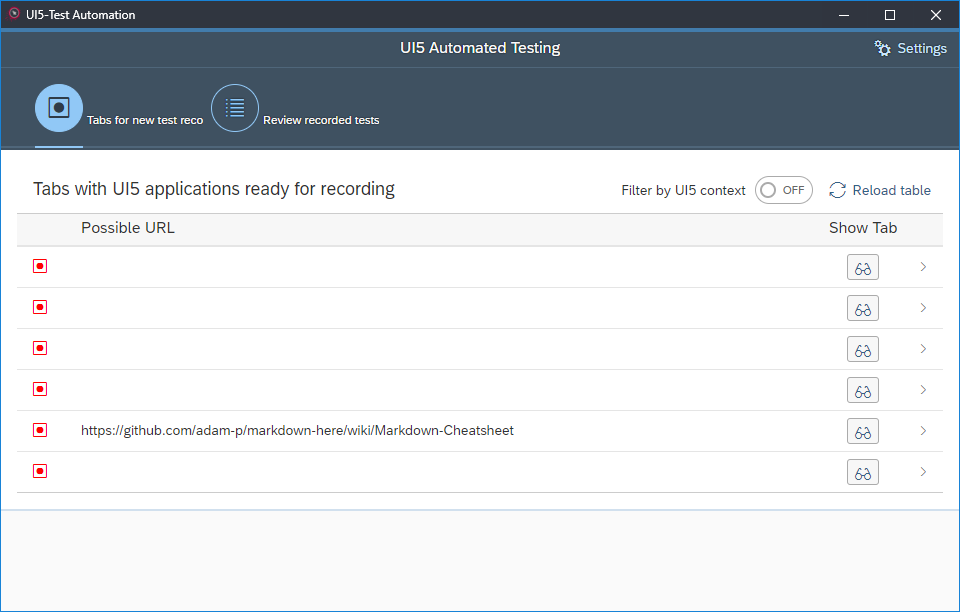
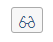
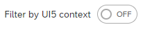
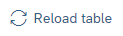

# UI5 Test Recorder

**!!The UI5 Test Recorder is still under developement!!**
>Therefore please be aware to run into issues, or missing features.  
>Instead of getting frustrated, please report them and we try to resolve them as fast as possible.

## Intended usage
We created the UI5 Test Recorder to easily record the use of a UI5 application.
On the other side we target on the usage of [UIVeri5](https://github.com/SAP/ui5-uiveri5) and [OPA5](https://sap.github.io/openui5-docs/#/Integration_Testing_with_One_Page_Acceptance_Tests_(OPA5)_2696ab5) for the test generation. Additionally we implemented the test generation for [TestCafé](https://github.com/DevExpress/testcafe).  

## How to start
To start go to the Chrome Web Store&copy; and install the UI5 Testrecorder from [here](https://chrome.google.com/webstore/detail/ui5-test-recorder/hcpkckcanianjcbiigbklddcpfiljmhj).  
After the installation finished you will find a new icon next to the address bar of Chrome:  
  
By clicking on this icon you start the UI5 Testrecorder and the Start-Page opens:  
  
Voilá you can start.

## Start Page
On the Start Page you get the choice to start a new recording or review your existing ones. 

### Start a new recording
To start a new recording, just click on the list of the Start Page and the UI5 Testrecorder will start the recording process. 

### Additional Buttons and Functions (Tabs for new recordings)
At the Start Page we have some additional functionalities which may be not self-explanatory, so they are described below.

There is a glasses button  for each list item. This button can be used to focus on the Tab/Window represented by the list item.  

The switch  triggers a new search over all open Tabs/Windows of Chrome to find only Web-Applications/Web-Pages running the UI5 Framework. Otherwise the extension only shows all Tabs within windows which are active, nevertheless if they contain a UI5 application or not.

There is a reload button  within the table toolbar to reload the table. 
The reload functionality is necessary, because the UI5 Testrecorder checks for running UI5 applications or active tabs only at startup. If new tabs are created or opened, the UI5 Testrecorder will not be informed. Therefore we implemented the reload button so you can trigger the search again and list all new opened tabs also.

### Review recorded tests
At the UI5 Testrecorder you can save the tests you have recorded for further usage. 
This tests can be found at the *Review recorded tests* tab.  
To open an existing record just click on the list item.

[Record new Test](./recordTest.md)  
[Review a recorded Test](./testDetailPage.md)