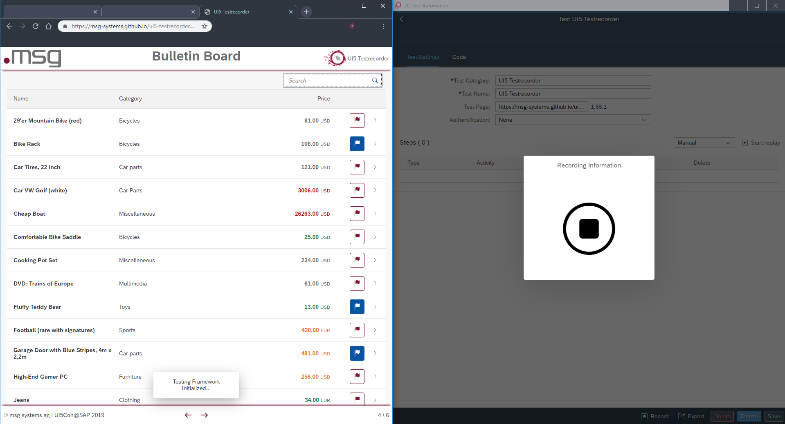
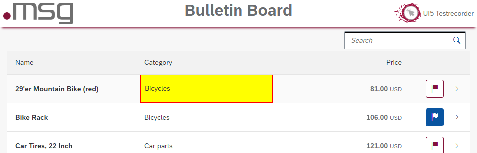
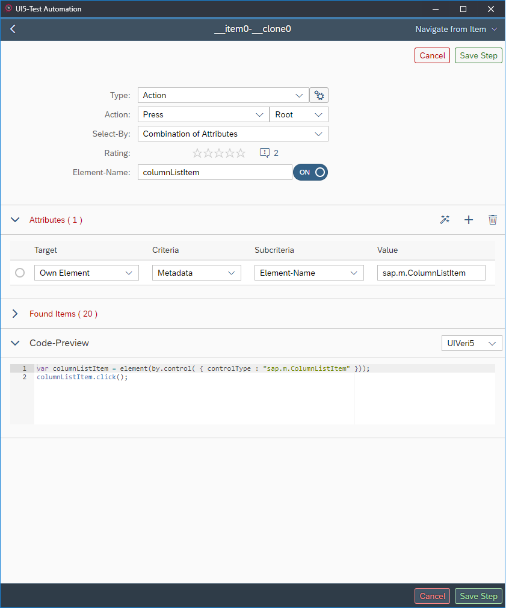
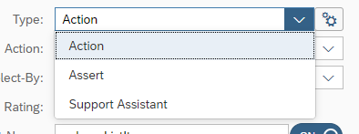
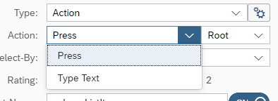
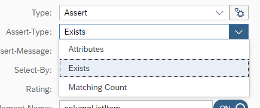
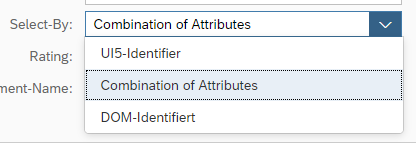
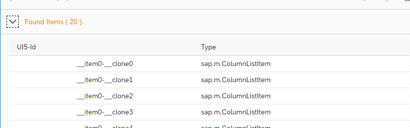

# Record a new Test
[As described](./documentation.md) you can start the recording of a new test, just by clicking on a list item with the correct link to your application.  
This will trigger the UI5 Testrecorder to start the recording which give you some sort of this result:  
  

As shown at the bottom of the application we get a Toast message indicating that the Testrecorder has a connection to your UI5 application. Additionally the Testrecorder switches to the wait state, and is waiting for an interaction with the UI5 application.

When you move your mouse over the screen detected parts will be highlighted.  

After clicking on an item the Testrecorder switches to a detail page for the test step.
  
At the Header you can decide which type of test step you want to perform:  
  
There are actions and assertions. Actions are for actions you want to perform on the application. Assertions are for specific controls, you want to see or check thier properties for certain values. These differences can be selected by the action select box below: 
    

Actions can be: 
- **Press**, used for clicking on elements or buttons.
- **EnterText**, used for typing text into Inputs/TextFields or SearchFields  
  
Assertions can be: 
- **Exists**, checks only if a control with specific properties exists on the screen
- **Attributes**, same as 'Exists' but allows you to add additional checks for the control attributes
- **Matching** Count, used for lists or tables to check the number of items contained within thier aggregations.

The third selection can be done, on how the control should be selected:  

If you use the:
- **UI5-Identifier**, you can use an unique ID given by the developer, which gives you a fixed 100% match but is most unflexible
- **Combination of Attributes**, you can select attributes of the control you have clicked on at the UI5 application to find it again during tests, this gives you a most flexible approach for control selection
- **DOM-Identifier**, the complete DOM-Id with all prefixes generated by UI5, it is same qualified like the UI5-Identifier

## Found Items List
If you use the *Combination of Attributes* it is possible that you select a combination of attributes which is valid for more than one control. 
You can see how specific your attribute combination is, by the list below:  
  
If it shows only one entry left, you have a specific enough combination of attributes describing your control.

## Navigating to Parent/Children
Sometimes you accidentially select an element which is not the element you had in mind. This also can happen through the UI5-Testrecorder, because the convertion from DOM-Elements to UI5-Controls can be tricky.  
You can navigate to the Parent/Children by the top right dropdown menu:  
  
The parent menu-entry is self-explained. 
The children can be selected through the *Aggregations* menu-entry, because child-elements are containes within aggregations in UI5. Therefore you have to select a suitable aggregation to get the children, try to use *content* or *items* this are the most used aggregations for content shown on the screen.

## Control Attributes
There are a lot of attributes a control can have, for an overview have a look at the [Attributes page](./attributes.md).